# 🌍 OpenWYD Modern Emulator

> **A Next-Gen, High-Performance MMORPG Emulator for "With Your Destiny" built with Node.js, TypeScript, and Serverless Architecture.**

This project reimagines the classic WYD server architecture (`DBSRV` + `TMSRV`) using modern DevOps practices. It replaces legacy file-based persistence and monolithic processes with a **Microservices-inspired**, **Event-Driven** architecture focusing on zero-latency gameplay and robust data integrity.

## 📐 High-Level Architecture

We utilize a **Gateway pattern** for networking and a **Write-Behind pattern** for data persistence.

```mermaid
graph TD
    %% Clients
    Client(["Game Client"]) -- "TCP / Encrypted" --> Connect["🛡️ Connect Server"]

    %% Core Logic
    Connect -- "Clean Packets" --> Timer["⚔️ Timer Server"]
    
    %% State & Locking
    Timer -- "Session Lock / PubSub" --> Redis[("Redis")]
    
    %% Async Persistence
    Timer -- "Save Event (JSON)" --> SQS["AWS SQS (LocalStack)"]
    SQS --> Lambda["cloud_queue: Persistence Service"]
    Lambda -- "Write" --> Mongo[("MongoDB")]

    %% Observability
    subgraph Observability ["LGTM Stack"]
        Loki[Logs]
        Tempo[Traces]
        Prom[Metrics]
        Grafana[Dashboard]
    end
```

