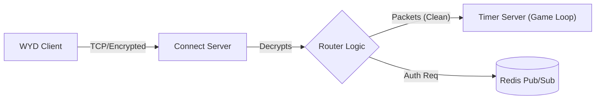

# 🛡️ WYD Connect Server (TCP Gateway)

> **High-Performance TCP Gateway & Packet Decryptor for the WYD Emulator.**

This service acts as the **Edge Layer** of the infrastructure. It is responsible for accepting direct TCP connections from the Game Client, handling the security handshake, decrypting traffic, and forwarding "clean" packets to the logic services (`timer-server`).

## 🏗️ Architecture

The `connect-server` contains **no business logic** (damage calculation, drops, etc.). It functions strictly as a **TCP Reverse Proxy** specialized in the proprietary WYD protocol.

