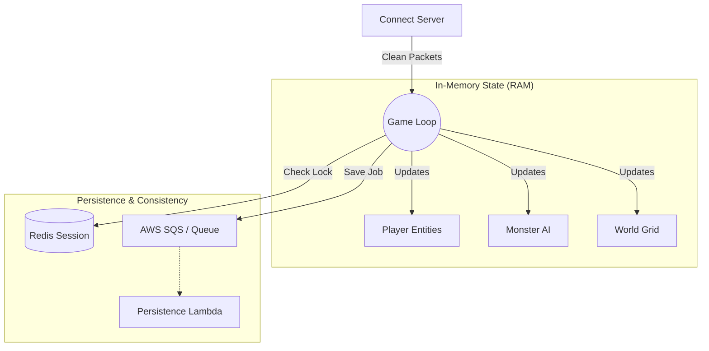

# ⚔️ WYD Timer Server (Game Core)

> **The Authoritative State Machine and Logic Engine for the WYD Emulator.**

The `timer-server` is the "heart" of the emulator. It is responsible for simulating the game world, processing player actions, calculating physics/combat, and maintaining the in-memory state of all active entities.

## 🏗️ Architecture

Unlike traditional emulators, this server **does not perform blocking database writes**. It follows a **Write-Behind** pattern using Queues to ensure zero-latency gameplay.

